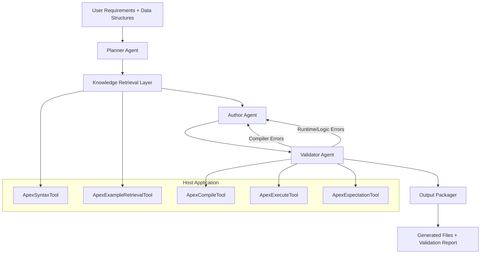

# APEX Rules Agent v2: Architecture & Implementation Plan

## 1. Objective
Build an APEX-aware coding agent system inside this project that can generate valid, functional APEX YAML configurations from:
- business requirements documents
- one or more input data structures (JSON schema, Java model summary, or sample payloads)

The system must follow strict APEX syntax and validate outputs using both compiler and runtime execution.

### 1.1 Required Outputs
- one or more `.yaml` files (rule-config, scenario, component, enrichment, etc.)
- sample `.json` test payloads
- machine-readable validation report (`validation-report.json`)
- optional human summary (`validation-summary.txt`)

### 1.2 Non-Goals
- replacing the official APEX docs
- auto-deploying configs to production
- bypassing compiler/runtime validation

## 2. Architecture Overview

This plan extends the existing Spring Boot CLI app and adds an APEX generation pipeline with strict validation loops.

## 3. Knowledge Injection Strategy (Critical)

The agent must be grounded. It will not rely on raw prompt memory of all docs.

### 3.1 Three-Layer Knowledge Strategy
1. **Curated Syntax Pack (always loaded)**
     - compact APEX keyword/structure guide distilled from docs
     - canonical templates for common document types
     - SpEL do/don't rules

2. **Retrieval from Example Corpus (on demand)**
     - indexed YAML examples from:
         - `apex-playground/examples` (~68 files)
         - `apex-demo/src/test/resources` (~375 files)
         - `apex-core/src/test/resources`
     - retrieval based on requested capability (rule-group, scenario, lookup, transformation, component)

3. **Validation Feedback as Ground Truth**
     - compiler + runtime feedback drives correction loop
     - retries capped (default: 3)

### 3.2 Retrieval Design
- **Index metadata** per file:
    - `docType`, `features`, `keywords`, `spELPatterns`, `complexity`, `crossFileRefs`
- **Primary retrieval**: lexical/tag-based for deterministic behavior
- **Optional retrieval**: vector-based (Spring AI vector store) if enabled
- **Few-shot assembly**: top 2–5 examples attached to author prompt

### 3.3 Condensed Syntax Guide Artifact
Generate and version a local file (for agent use) such as:
- `knowledge/apex-syntax-compact.yaml`

It should include:
- required metadata fields per document type
- supported top-level sections by type
- common keyword constraints
- high-confidence templates

## 4. Multi-Agent Orchestration (One or More Agents)

### 4.1 Modes
- **Single-agent mode (MVP)**: one model executes planner/author/validator steps sequentially
- **Multi-agent mode (target)**:
    - **Planner Agent**: decomposes requirements into artifacts
    - **Author Agent**: writes YAML + sample data
    - **Validator Agent**: runs compile/execute/assertions and categorizes failures
    - **Coordinator**: controls retries and completion gates

### 4.2 Delegation Contract
- Planner outputs a `GenerationPlan` (artifact list + dependencies)
- Author outputs candidate files
- Validator outputs typed diagnostics
- Coordinator either accepts or loops back with precise fix instructions

## 5. Tooling Design (Replace Thin ApexTools)

Do not use one generic method. Use typed tools with typed outputs.

### 5.1 Tool APIs

1. `ApexSyntaxTool`
     - `getDocTypeTemplate(docType)`
     - `getRequiredFields(docType)`
     - `getKeywordRules(section)`

2. `ApexExampleRetrievalTool`
     - `searchExamples(featureTags, docType, topK)`
     - returns paths + snippets + feature metadata

3. `ApexCompileTool`
     - `validateLexical(yamlPathOrContent)`
     - `validateCompiler(yamlPathOrContent)`
     - returns explicit compiler diagnostics

4. `ApexExecuteTool`
     - `evaluateYaml(yamlContent, jsonFacts)`
     - returns structured `RuleResult` fields:
         - `success`
         - `resultType`
         - `failureMessages`
         - `enrichedData`
         - `childResults`
         - `executionPath`

5. `ApexExpectationTool`
     - `assertExpectedOutcomes(actualResult, expectations)`
     - validates business intent, not only syntax/runtime success

### 5.2 Validation Loop
1. Author drafts YAML
2. lexical/compiler validation
3. runtime execution with test payloads
4. expectation assertions
5. if failure: produce minimal fix instructions and retry (max 3)
6. on success: package outputs + report

## 6. Error Taxonomy (Mandatory)

Every failure is classified and returned in a normalized schema.

### 6.1 Error Classes
- `E_SYNTAX_YAML`: invalid YAML format/structure
- `E_SCHEMA_APEX`: invalid APEX section/keyword placement
- `E_SPEL_PARSE`: malformed SpEL
- `E_SPEL_RUNTIME`: missing fields/type coercion issues
- `E_REF_RESOLUTION`: missing external refs / cross-file failures
- `E_ENGINE_RUNTIME`: execution exception inside engine
- `E_LOGIC_MISMATCH`: compiled and ran, but does not meet business expectations

### 6.2 Diagnostic Format
Each issue should include:
- `errorCode`
- `message`
- `location` (file, section, key, line if available)
- `suggestedFix`
- `severity`

## 7. Multi-File and Scenario Support

The generator must support bundles, not only single `rule-config` files.

### 7.1 Supported Artifact Types
- `rule-config`
- `scenario`
- `scenario-registry`
- `component`
- `enrichment`
- `external-data-config`
- `pipeline-config`

### 7.2 Bundle Generation
For each request, output a manifest:
- `artifact-manifest.json`
    - `files[]`
    - `docType`
    - `dependsOn`
    - `validationStatus`

### 7.3 Reference Integrity Checks
- verify referenced files exist
- verify IDs referenced by groups/chains exist
- verify cross-file links resolve

## 8. Output File Management

### 8.1 Directory Convention
- `generated/apex/<request-id>/`
    - `rules/`
    - `scenarios/`
    - `components/`
    - `data/`
    - `reports/`

### 8.2 Naming Convention
- `<domain>-<purpose>-v<semver>.yaml`
- `<domain>-sample-input-<n>.json`
- `validation-report.json`

### 8.3 Idempotency
- each run gets a unique `request-id`
- reruns with same request can create `revision` folders

## 9. Prompting Strategy (Actionable)

### 9.1 System Prompt Additions
Must include explicit rules:
- never invent unknown APEX keywords
- retrieve template + examples before drafting
- always run compile + execute + expectations before final answer
- include failure reasoning when retries exhausted

### 9.2 Prompt Pack Content
- compact syntax reference
- 2–5 feature-matched examples
- strict output schema for generated files
- explicit retry policy

## 10. Compatibility & Dependency Risk Plan

Current host project:
- Spring Boot `4.0.2`, Java `23`

APEX artifacts:
- built in ecosystem aligned with Spring Boot `3.4.x`, Java `21`

### 10.1 Risk
Potential transitive conflicts (Spring framework version mismatches).

### 10.2 Mitigation
1. Add `apex-core` and `apex-compiler` dependencies in a feature branch.
2. Run compile + tests.
3. If conflicts appear, isolate APEX execution behind one of:
     - shading/relocation for APEX runtime wrapper
     - separate local worker process (CLI bridge)
     - module split with independent dependency graph
4. Document decision in `reports/compatibility-report.md`.

## 11. Test Strategy for the Agent

This is required to prove the system works.

### 11.1 Test Matrix
- simple validation rules
- rule groups (AND/OR)
- enrichments (lookup/calculation/field/conditional mapping)
- scenarios and scenario registries
- components with dependencies
- transformations
- negative tests (expected compile/runtime failures)

### 11.2 Acceptance Criteria
- >= 95% lexical/compiler pass on generated artifacts
- >= 90% runtime success on intended happy-path payloads
- >= 90% expectation assertion pass rate
- retry loop converges within 3 attempts for >= 85% of cases

### 11.3 Regression Suite
- golden requirement set (20–50 curated business requirements)
- deterministic comparison of generated outputs and validation results
- CI job runs nightly and on prompt/tool changes

## 12. Implementation Phases

### Phase 0: Foundation
- add APEX dependencies
- smoke test compiler and runtime invocation

### Phase 1: Typed Tooling
- implement `ApexCompileTool`, `ApexExecuteTool`, `ApexExpectationTool`
- return structured JSON responses

### Phase 2: Knowledge Layer
- build example index and tag metadata
- create compact syntax artifact
- implement retrieval API

### Phase 3: Orchestration
- implement single-agent sequential loop (planner/author/validator roles)
- add retry controller

### Phase 4: Multi-Agent Mode
- split into planner/author/validator coordinator architecture
- add role prompts and delegation contracts

### Phase 5: Quality & CI
- build regression suite
- add acceptance dashboard metrics

## 13. Example End-to-End Flow

1. User provides requirements + data structure.
2. Planner decides required files (`rule-config` vs scenario bundle).
3. Retrieval returns matching templates/examples.
4. Author drafts files.
5. Validator runs:
     - lexical/compiler checks
     - runtime execution
     - expectation assertions
6. If failures, coordinator sends targeted fixes to author.
7. On success, package outputs in `generated/apex/<request-id>/`.
8. Return YAML + test data + validation report summary.

## 14. Deliverables Checklist

- [ ] APEX dependencies integrated and compatibility tested
- [ ] Typed Apex toolset implemented
- [ ] Knowledge index + retrieval implemented
- [ ] Single-agent generation/validation loop complete
- [ ] Multi-agent mode available (feature flag)
- [ ] Output packager + manifest implemented
- [ ] Acceptance test matrix + regression suite operational

---

This v2 plan is implementation-grade and directly addresses grounding, validation fidelity, multi-agent orchestration, corpus learning, error taxonomy, and measurable quality gates.

